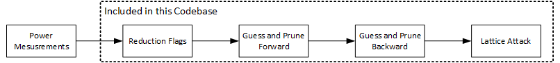

**Artifacts for Side-Channel Attack on Number Theoretic Transform(NTT) in FALCON**
This repository contains the experimental artifacts for reproducing our side-channel attack on the Number Theoretic Transform (NTT) used in FALCON. 
The attack exploits the internal structure of the Cooley–Tukey NTT algorithm and leverages small information leaks from in-place modular reductions within each butterfly operation. By combining these leaks, the attack progressively recovers secret information.

For a full technical description of the attack, please refer to our TCHES paper.

The notebook Artifact_Demo.ipynb serves as the main orchestrator and calls all submodules of the attack pipeline. The complete attack consists of four stages. Each stage is optional, as we provide pre-generated outputs that allow users to start from later steps if desired.

* Step 1: Generate In-Place Modular Reduction Flags
In this step, we simulate small polynomials 𝑓 and 𝑔 using the same Gaussian distribution as in FALCON. The simulation produces in-place modular reduction flags. This step is included because real power measurements may not be available in the user’s environment.

* Step 2: Run Forward Inference
This stage performs forward inference using the reduction flags. For convenience, we provide a set of pre-recorded flags so that users may begin directly from this step.
This stage requires: A CUDA-compatible GPU, At least 1.5 TB of disk space and up to two weeks of runtime per coefficient attack, depending on hardware

* Step 3: Run Backward Inference
This step executes the backward inference process and generates the pruned keyset values. Since the inference typically takes around two weeks. To reduce the burden on users, we also provide a completed output of the Guess-and-Prune (G&P) process.

* Step 4: Perform Lattice-Reduction-Based Pruning
In the final stage, we apply lattice-reduction-based pruning and selection to the output file Keyset_Values.csv. This step reports the remaining unknown coefficients and their locations.
Since Steps 2 and 3 are computationally expensive, we also include a finalized keyset file for users who wish to start directly from this stage.

**Contents of the repository**
* This repository provides the core implementation of the attack framework described in the paper, including:
1. Guess-and-Prune attack logic
2. Lattice-reduction-based pruning
3. Tools for simulating modular reduction flags

* The following components are not included:
1. Power measurement traces and tooling
2. Methods for extracting Points of Interest (POIs). These components are documented in previous publications.

**Required software packages**
Out attack can be done using Python. The software requires the following package to execute: 
* For flag generation: csv, random, sympy

* For the Guess and Prune strategy: os, itertools, pandas, numpy, sympy, concurrent.futures, re, sys, pathlib. Note: Our guess and prune utilizes cupy and CUDA. Therefore, a CUDA device is required. 

* Lattice Reduction: fpylll, argparse, ast, math, itertools

* General orchestration: subprocess

*Please refer to Artifact_Demo.ipynb for step by step instructions on how to run the attack*

